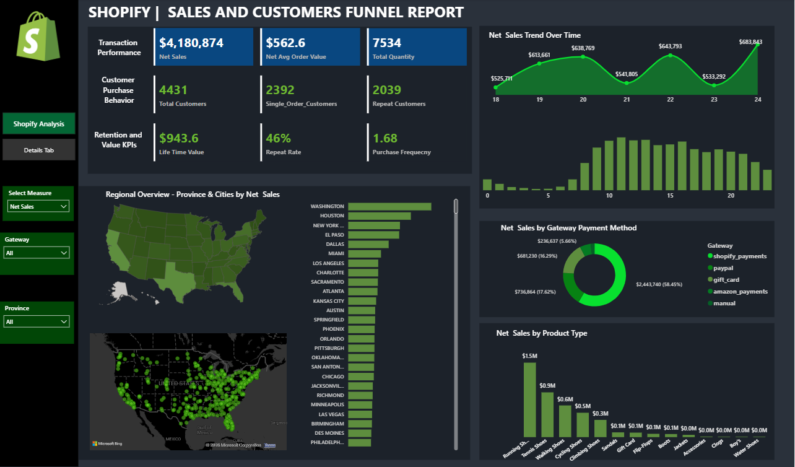
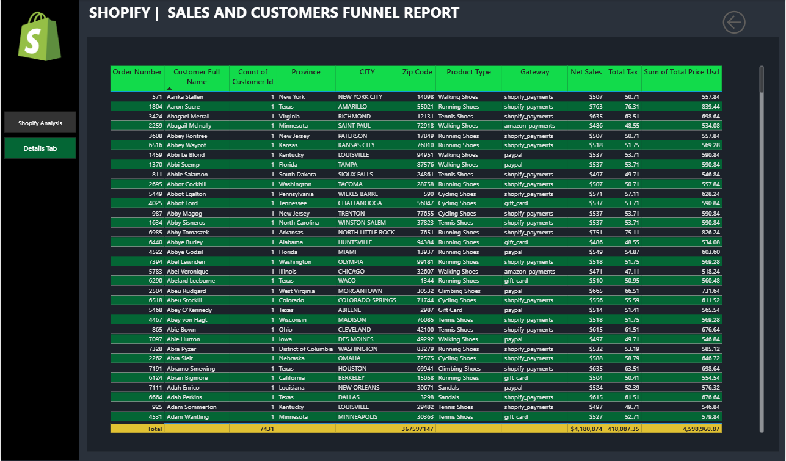

# analyse_ventes_shopify
Tableau de bord interactif Power BI pour analyser les ventes Shopify, le comportement des clients, les tendances commerciales et les performances des produits à travers des KPI et des visualisations dynamiques.

## 1 Présentation du projet

Ce projet consiste à développer un **tableau de bord interactif sous Power BI** permettant d’analyser les données de ventes Shopify.

L’objectif est d’obtenir une vision globale de la performance des transactions, du comportement d’achat des clients et de leur valeur à long terme, afin de faciliter la prise de décision basée sur les données.

## 2 Objectifs

* Analyser la performance des ventes et des transactions.
* Étudier le comportement d’achat des clients.
* Identifier les clients ayant effectué plusieurs commandes.
* Analyser la fidélisation et la valeur client.
* Étudier les tendances des ventes selon le temps et la localisation.
* Analyser les méthodes de paiement et les performances des produits.
* Générer des insights permettant d'orienter la prise de décision.

## 3 Outils utilisés

* **Power BI**
* **Power Query**
* **DAX**

## 4 Principaux indicateurs (KPIs)

### Performance des transactions

* Net Sales
* Total Quantity
* Average Order Value

### Comportement des clients

* Total Customers
* Single Order Customers
* Repeat Customers

### Fidélisation et valeur client

* Lifetime Value (LTV)
* Repeat Rate
* Purchase Frequency

## 5 Analyses et visualisations

Le tableau de bord permet notamment d'analyser :

## 6 Fonctionnalités du dashboard

* KPI Cards
* Filtres interactifs
* Analyse géographique
* Analyse temporelle
* Sélecteur dynamique des indicateurs
* Drill-through vers les détails des transactions
* Visualisations interactives

## 7 Insights

L'analyse permet d'identifier les tendances liées aux ventes, au comportement des clients, aux achats répétés, aux méthodes de paiement et aux performances des produits.

Ces informations peuvent être utilisées pour mieux comprendre la performance commerciale et soutenir les décisions basées sur les données.

## 8 Compétences développées

À travers ce projet, j'ai mis en pratique :

* La préparation et le nettoyage des données avec **Power Query**.
* La modélisation des données dans **Power BI**.
* La création de mesures et d'indicateurs avec **DAX**.
* La conception de tableaux de bord interactifs.
* L'analyse des données commerciales.
* La création de visualisations adaptées aux besoins métier.
* La génération d'insights à partir des données.

